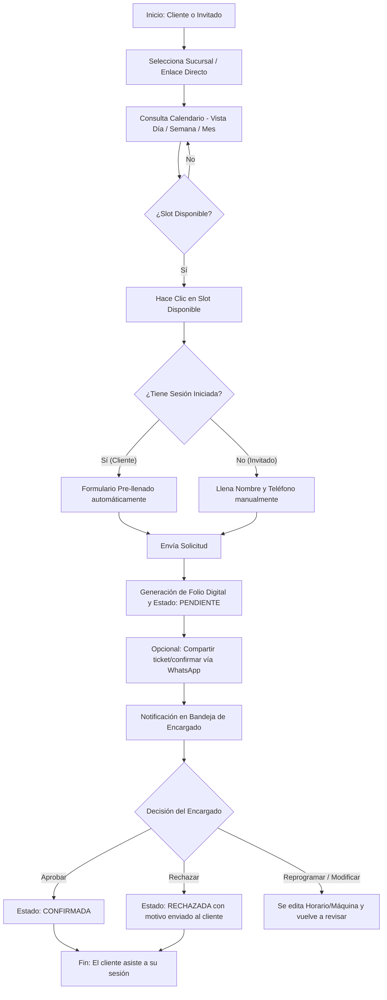

# 🕹️ Manuales de Usuario — Pump It Up Hub
### Sistema Modular de Reservaciones de Maquinitas de Baile

Bienvenido a la documentación oficial y manuales de usuario del **Pump It Up Hub**, la plataforma web premium para la gestión y reservación de cabinas arcade de ritmo **Pump It Up (PIU)**.

Este documento está estructurado para detallar el flujo de trabajo, responsabilidades, interfaces y capacidades de cada uno de los **cuatro roles** que interactúan en el sistema:
1. [👑 Superadministrador (Superuser)](#1--manual-del-superadministrador-superuser)
2. [⚙️ Encargado de Local (Manager)](#2--manual-del-encargado-de-local-manager)
3. [🕺 Cliente Registrado (Player)](#3--manual-del-cliente-registrado-player)
4. [👤 Invitado Público (Guest)](#4--manual-del-invitado-público-guest)

---

## 📊 Matriz Comparativa de Permisos y Alcances

| Característica / Operación | 👑 Superuser | ⚙️ Encargado | 🕺 Cliente | 👤 Invitado |
| :--- | :---: | :---: | :---: | :---: |
| **Registrar/Eliminar sucursales en cascada** | Si | No | No | No |
| **Administrar personal (Encargados)** | Si | No | No | No |
| **Editar catálogos maestros (Gabinete, Software)** | Si | No | No | No |
| **Mantenimiento y Respaldos JSON globales** | Si | No | No | No |
| **Reasignar/Transferir máquinas de local** | Si | Si | No | No |
| **Configurar marca, horario y costos del local** | Si | Si | No | No |
| **Configurar modo de lealtad (Consumo vs Visitas)** | Si | Si | No | No |
| **Aprobar, rechazar o reprogramar reservas** | Si | Si | No | No |
| **Crear reservas directas en mostrador** | Si | Si | No | No |
| **Registrar y editar clientes locales** | Si | Si (Paginado) | Si (Propio perfil) | No |
| **Ver datos sensibles (teléfono/correo) de otros** | Si | Si | No (Privado) | No |
| **Consultar historial personal y estadísticas** | No | No | Si (Pass QR) | No |
| **Ver disponibilidad en tiempo real (Día/Sem/Mes)**| Si | Si | Si | Si |
| **Enviar solicitud de reservación en línea** | Si | Si | Si (Auto-llenado) | Si (Llenado manual) |

---

## 🕹️ Flujo General de Reservación

El siguiente diagrama detalla cómo fluye una reservación desde que un jugador (Cliente o Invitado) la solicita hasta que se registra y aprueba:

---

## 1. 👑 Manual del Superadministrador (Superuser)

El **Superadministrador** posee control absoluto sobre toda la plataforma y tiene una vista global que trasciende a las sucursales individuales.

### 🔑 Acceso y Login
* **Usuario por defecto:** `superadmin`
* **PIN de seguridad:** `8888`
* **Ingreso:** Haz clic en el botón `🔐 Acceso Staff` en la esquina superior derecha, introduce las credenciales y accede a la **Consola Global**.

### 🏢 Gestión de Locales (Pestaña "Locales")
* **Registrar Nuevo Local:** Haz clic en el botón `🏢 Registrar Nuevo Local` en la barra superior. Define el nombre, ciudad, horarios de operación básicos y logo.
* **Acceso Directo:** Puedes copiar el enlace del cliente (`?local=id-del-local`) para compartirlo.
* **Entrar a Sucursal:** El botón `⚡ Entrar` te permite "infiltrarte" temporalmente como el administrador de esa sucursal en particular.
* **Eliminación en Cascada (Crítico):** Si eliminas un local, el sistema borrará automáticamente de la base de datos todas las máquinas, reglas de operación, solicitudes, reservaciones y cuentas de encargados asociadas a este.
  
> [!CAUTION]
> La eliminación en cascada es irreversible. Úsala únicamente cuando una sucursal cierre definitivamente.

### 👥 Gestión de Encargados (Pestaña "Encargados")
* **Crear Cuentas de Staff:** Permite dar de alta a nuevos encargados, asignándoles un nombre, un PIN personal de acceso (mínimo 4 dígitos), un correo electrónico, un avatar temático y la **sucursal específica** que tendrán a su cargo.
* Un encargado solo podrá ver y modificar los datos correspondientes a su sucursal asignada.

### 🕺 Directorio Global de Jugadores (Pestaña "Clientes / Jugadores")
* Visualiza la lista completa de usuarios registrados en el sistema de manera global.
* El Superadmin tiene permisos para **Crear**, **Editar** y **Eliminar** cuentas de jugadores directamente desde esta consola, incluyendo la modificación de sus Ligas, Gamertags y números de contacto.
* **Escaneo de QR / Pass de Jugadores**: El sistema ofrece dos métodos para que el encargado o Superadmin lea el pase digital de un jugador:
  * **Método A: Cámara del Dispositivo (Celular, Tablet o Laptop)**:
    1. En la pestaña **Clientes**, pulsa el botón **`📸 Escanear QR`**.
    2. Concede los permisos de cámara si el navegador los solicita.
    3. Apunta la cámara (trasera por defecto en móviles) al código QR del pase digital en el teléfono del jugador. El sistema lo leerá automáticamente, cerrará el escáner y mostrará los datos del jugador.
  * **Método B: Pistola o Lector QR Físico (USB / Bluetooth)**:
    1. Haz clic en la caja de texto del buscador del directorio de clientes.
    2. Escanea el código QR de la pantalla del cliente. El lector ingresará el ID único (`p_...`) y presionará Enter.
  * *Resultado*: Ambos métodos filtran la vista para mostrar únicamente la tarjeta de ese jugador específico. A continuación, el encargado dispone de las siguientes acciones rápidas en la tarjeta:
    * **`➕ Visita` (Disponible en modo Visitas)**: Botón de un solo clic que acredita instantáneamente 1 visita al saldo del jugador en mostrador.
    * **`➕ Consumo` (Disponible en modo Puntos)**: Abre un diálogo emergente para ingresar el monto en pesos gastado por el jugador y acredita de forma automática los puntos correspondientes según la tasa configurada en el local.
    * **`⭐ Ajustar`**: Permite realizar modificaciones manuales y directas (tanto positivas como negativas) de puntos o visitas, detallando un motivo de auditoría.
    * **`🎁 Canjes`**: Muestra la lista de cupones y premios solicitados por el jugador en este local, permitiendo al encargado marcar el premio como **Entregado** al momento de dárselo físicamente al cliente.
* Cuenta con navegación optimizada por páginas (15 registros por vista) para asegurar un rendimiento de carga instantáneo en todo momento.

### 🖥️ Catálogos Maestros de Gabinetes y Software (Pestañas "Modelos" y "Versiones")
* **Modelos de Gabinete:** Permite definir los estándares globales de hardware que las sucursales pueden poseer (ej. *LX de 55 pulgadas*, *TX de 50 pulgadas*, *FX de 42 pulgadas*).
* **Versiones de Software:** Permite registrar los softwares del juego (ej. *Pump It Up Phoenix*, *XX*, *Prime 2*), especificando año de salida, último parche oficial (`v1.08.0`) y modos de juego habilitados.
* Estas dos listas alimentan los desplegables cuando un encargado registra sus máquinas locales, evitando errores ortográficos o inconsistencias en los nombres del hardware y software.

### 🔀 Distribución de Máquinas (Pestaña "Máquinas por Local")
* Muestra el inventario total de máquinas en toda la red de locales.
* Cuenta con la función **Reasignar / Transferir Local**: Permite mover físicamente un gabinete de una sucursal a otra con 1 solo clic. Las reservaciones futuras de la máquina en el local de origen deberán ser canceladas manualmente por el staff.

### 💾 Respaldos y Mantenimiento de Datos (Sección Inferior)
* **Exportar Respaldo JSON:** Descarga un archivo con la base de datos completa (locales, máquinas, reservaciones, jugadores, logs). Es ideal para migraciones o copias de seguridad semanales.
* **Importar Respaldo JSON:** Carga un archivo JSON de respaldo previo para restaurar el sistema.
* **Restaurar Datos Demo:** Restablece las sucursales de prueba y registros iniciales para demostraciones rápidas.

---

## 2. ⚙️ Manual del Encargado de Local (Manager)

El **Encargado** o administrador de local (locatario) es el responsable de mantener operativas las máquinas, gestionar las solicitudes de los clientes y ajustar las reglas operativas de su sucursal.

> [!NOTE]
> **Sobre la Creación de Sucursales:** Un Encargado gestiona de manera exclusiva la sucursal que le ha sido asignada. Por razones de seguridad y consistencia en la red, la creación, eliminación o registro de nuevas sucursales es una capacidad global reservada **únicamente para el Superadministrador**. Si un locatario abre una nueva sucursal, debe solicitar su alta al Superadmin, quien le creará el espacio y (de ser necesario) le asignará una nueva cuenta de acceso.

### 🔑 Acceso y Login
* **Credenciales Demo:** `encargado_centro` (PIN `1234`) o `encargado_galaxy` (PIN `5678`).
* Al iniciar sesión, la interfaz del encargado se ajusta de inmediato al color de neón oficial de su local y restringe todas las pantallas para que solo afecten a su sucursal.

### 📥 Control de Solicitudes (Menú "Bandeja")
La bandeja está dividida por estados para facilitar la atención rápida:
1. **⏳ Pendientes:** Solicitudes enviadas por clientes o invitados en espera de aprobación.
2. **✅ Confirmadas:** Reservaciones aprobadas.
3. **❌ Rechazadas:** Historial de reservaciones denegadas.
4. **📋 Todas:** Bitácora total ordenada cronológicamente.

#### Acciones en Solicitudes Pendientes:
* **Aprobar Solicitud:** Confirma el espacio en la matriz. Cambia el estado a verde en la Vista Día de todos los usuarios.
* **Rechazar Solicitud:** Abre una ventana emergente donde se debe seleccionar o escribir el **Motivo del Rechazo** (ej. *Horario ocupado por torneo* o *Mantenimiento imprevisto*). Este motivo quedará visible para el cliente.
* **Modificar / Reprogramar:** Permite al encargado ajustar la fecha, hora, duración o cambiar al cliente de máquina si hay una colisión de horarios o avería técnica, sin necesidad de que el cliente vuelva a llenar el formulario.
* **Contacto Directo:** Cada tarjeta de solicitud incluye un botón directo de `💬 WhatsApp`. Al pulsarlo, abre una conversación con el número del cliente para dialogar sobre cambios en su reserva.

### 🕹️ Gestión de Inventario (Menú "Máquinas")
Muestra el catálogo activo de gabinetes de la sucursal.
* **Registrar Nueva Máquina:** Permite dar de alta gabinetes seleccionando el modelo y software desde el Catálogo Maestro global. Permite ingresar:
  * **Tarifa por Hora:** Costo específico de renta de ese gabinete.
  * **Accesorios Instalados:** Selección múltiple de complementos configurados (ej. *Sensores FSR Calibrados*, *Barra Reforzada*, *Pantalla Curva*, *Ventilador Personal*, *Cámara USB para Web Play*).
  * **Condición de los Pads:** Notas de estado físico (ej. *"Pad izquierdo sensible, Pad derecho requiere presión moderada"*).
* **Cambiar Estado Operativo:** Botón de un solo clic para alternar entre `Disponible` y `En Mantenimiento`. Al poner una máquina en mantenimiento, se bloquea toda su columna en el calendario diario para evitar que los clientes reserven en ella.

### ⚙️ Ajustes del Local (Menú "Configuración")
Este panel centraliza la personalización visual y operativa del negocio:

1. **Identidad y Branding:** Ajusta el nombre de la sucursal, eslogan publicitario, icono (emoji distintivo), color de neón e **Imagen de Banner**.
2. **Ubicación y Contacto:** Dirección detallada, ciudad, teléfono y un enlace directo a Google Maps/Waze. También el teléfono de WhatsApp que recibirá los mensajes de confirmación de los clientes.
3. **🎁 Programa de Lealtad (Configurable):**
   * **Modo de Acumulación**: El encargado elige entre modo **"Por Consumo"** (acumula según el costo de la reserva) o **"Por Cantidad de Visitas"** (cada reserva asistida otorga exactamente 1 visita).
   * **Tasa de Acumulación (Ratio)**: Si se selecciona el modo por consumo, se define el valor de conversión (ej. $10 pesos = 1 punto). Esta opción se oculta automáticamente al seleccionar el modo por visitas.
   * **Premios de Lealtad**: Catálogo interactivo de premios donde el encargado puede registrar el nombre del premio, ícono decorativo, descripción y costo en puntos o visitas requeridas.
   * **Estructura de Niveles y Beneficios**: Permite al encargado definir las metas de puntos/visitas necesarias para subir a los tiers **Plata**, **Oro** y **Platino**, así como configurar el porcentaje de descuento en reservaciones que cada nivel otorga de forma automática.
4. **Reglas Operativas**:
   * **Horas de Apertura y Cierre:** Límite para las cuadrículas del calendario.
   * **Intervalo / Duración de Slot:** Configura la duración base de los turnos de juego (30, 45, 60, 90 o 120 minutos). Las reservaciones de los clientes se ajustarán obligatoriamente a múltiplos de este bloque.
   * **Límites de anticipación y cancelación:** Días máximos con los que un cliente puede reservar al futuro (ej. 14 días) y horas de aviso previo requeridas para cancelar de forma autónoma (ej. 2 horas antes).
   * **Reservas simultáneas:** Límite de reservaciones activas permitidas por jugador.
5. **Políticas de Pago:**
   * Habilita o deshabilita la exigencia de un anticipo para confirmar el turno.
   * Establece el porcentaje requerido (25%, 50%, 75% o 100%).
   * Redacta las instrucciones de pago (ej. *número de tarjeta/CLABE, banco titular y solicitud de enviar captura por WhatsApp*).
6. **WiFi y Reglamento:** Campo para el nombre de red y contraseña del WiFi de la sala (visible para los clientes con sesión iniciada) y las reglas internas del local.

---

## 3. 🕺 Manual del Cliente Registrado (Player)

El **Cliente Registrado** es un jugador de la comunidad que cuenta con un perfil personalizado y acceso a herramientas de autogestión de sus reservaciones.

### 🔒 Privacidad de Datos y Seguridad
Para proteger la integridad de los jugadores de la comunidad, **toda la información de contacto sensible (como número telefónico y dirección de correo electrónico) de un cliente es completamente invisible para otros usuarios**. Solo los Encargados de Sucursal y el Superadministrador pueden ver los datos de contacto desde la consola de administración.

### 📝 Registro e Inicio de Sesión
* **Registro:** Se realiza desde el menú `🔐 Acceso Staff` o la pestaña `Mi Perfil` cuando no hay sesión activa. Solo requiere:
  * Nombre / GamerTag único (sin espacios, ej. `alex_piu`).
  * PIN numérico de acceso de al menos 4 dígitos (actúa como contraseña rápida).
  * Teléfono de contacto y Correo electrónico.
  * Opcionalmente, nivel de liga (Ligas Potosinas) y modo de juego preferido.

### 💳 Phoenix Pass (Tarjeta Digital de Identificación)
* En la parte superior de la vista "Mi Perfil", el cliente dispone de su tarjeta digital personalizada con su GamerTag y el nombre dinámico del local actual (`[LOCAL] PASS`).
* Al pulsar sobre el código QR decorativo, se abre una tarjeta de identificación digital expandida en alta resolución con el color oficial de su nivel de lealtad.
* Presenta este código QR en la recepción física del local para que el encargado pueda buscar tu GamerTag al instante y registrar tu visita.

### ⚡ Reservar con Perfil Activo
* Cuando un cliente con sesión iniciada visita la **Vista Día** y hace clic en un slot disponible (`＋ Disponible`), el formulario de solicitud se abre con sus datos ya cargados y una insignia verde que lo reconoce como jugador oficial.
* Puede seleccionar múltiplos del intervalo del local (ej. si el local es de 30 min, puede elegir 30 min, 1h, 1h 30m, etc.) y visualizar la tarifa total estimada en tiempo real.
* Al enviar la solicitud, no tiene que ingresar sus datos manualmente y el sistema liga la reserva directamente a su cuenta.

### 🎟️ Panel "Mi Perfil" (Dashboard de Autogestión)
Al iniciar sesión, se habilita la pestaña `Mi Perfil` en el menú principal:

* **Estadísticas de Juego:** Muestra el total de reservas acumuladas, cuántas han sido confirmadas por el staff y las horas totales que ha jugado en esa sucursal.
* **Estatus de Lealtad (Puntos vs Visitas)**: 
  * Muestra los puntos o visitas acumuladas de forma histórica.
  * Barra de progreso al siguiente Tier de descuento.
  * Tabla informativa de los beneficios asociados a cada rango según la modalidad de la sucursal activa.
* **Canje de Recompensas**: Muestra los premios activos del catálogo del local y permite al jugador solicitar el canje en tiempo real si cuenta con los puntos o visitas necesarias.
* **Mis Reservaciones:** Lista interactiva de todas sus solicitudes pasadas y futuras ordenadas por fecha.
  * **Ver Comprobante**: Abre el ticket con el folio único.
  * **Cancelar Reserva**: Si respeta el límite establecido por el local (ej. 2 horas antes), puede liberar el slot directamente.

---

## 4. 👤 Manual del Invitado Público (Guest)

El **Invitado** es un visitante anónimo que no desea registrar una cuenta en la plataforma, pero quiere consultar la disponibilidad o reservar un turno de juego.

### 🌐 Navegación y Consulta
* El invitado puede seleccionar cualquier local en la pantalla de bienvenida o entrar directo mediante un enlace compartido.
* Tiene acceso completo a la información pública del local: dirección, horarios oficiales, redes sociales y contacto telefónico.
* Puede navegar por el calendario interactivo en tres formatos:
  1. **Vista Día:** Grid de horas vs máquinas para ver con precisión qué bloques están libres (celdas oscuras con botón `Disponible`) u ocupados (celdas de color con el nombre del jugador).
  2. **Vista Semana:** Tarjetas informativas de los siguientes 7 días con estadísticas de ocupación.
  3. **Vista Mes:** Calendario clásico con indicadores numéricos de reservas diarias.

### 📅 Proceso de Reserva como Invitado
1. En la **Vista Día**, selecciona el día que deseas jugar y haz clic en el botón `Disponible` del bloque horario y la máquina que prefieras.
2. Se abrirá el formulario de solicitud. Al no tener una sesión iniciada, deberás **introducir obligatoriamente**:
   * Tu Nombre / GamerTag.
   * Tu número de teléfono o celular (10 dígitos).
   * Opcionalmente, notas adicionales para el staff.
3. El formulario mostrará el costo total calculado y las **instrucciones de anticipo o depósito** si el local las requiere.
4. Presiona el botón `🚀 Enviar Solicitud`.
5. **Pase Digital:** Al procesarse la solicitud, el sistema te mostrará tu ticket digital en pantalla con un **Folio Único** y el estado `En Revisión`.
6. Haz clic en el botón `💬 Confirmar / Notificar por WhatsApp` para abrir WhatsApp y enviar automáticamente los detalles de tu reservación y tu folio al encargado para acelerar su confirmación.

> [!WARNING]
> Como invitado, si cierras el navegador o la pestaña web, perderás el acceso visual al ticket digital de reservación. Guarda tu folio o envíalo por WhatsApp para que puedas realizar aclaraciones con el encargado. Si deseas autogestionar y ver tu historial, te recomendamos registrar un perfil de Cliente.

---

### 💡 Soporte y Notas Adicionales
* **Sincronización:** Si el indicador de la esquina inferior izquierda se muestra en **Verde**, los datos se están guardando en tiempo real en la nube a través de Firebase Firestore. Si se muestra en **Amarillo**, el sistema opera en modo local (LocalStorage) y los cambios solo persistirán en tu navegador actual.
* **PIN de Acceso:** No olvides tu PIN. Es la llave rápida para ingresar a tu cuenta de cliente o encargado sin requerir contraseñas largas.
